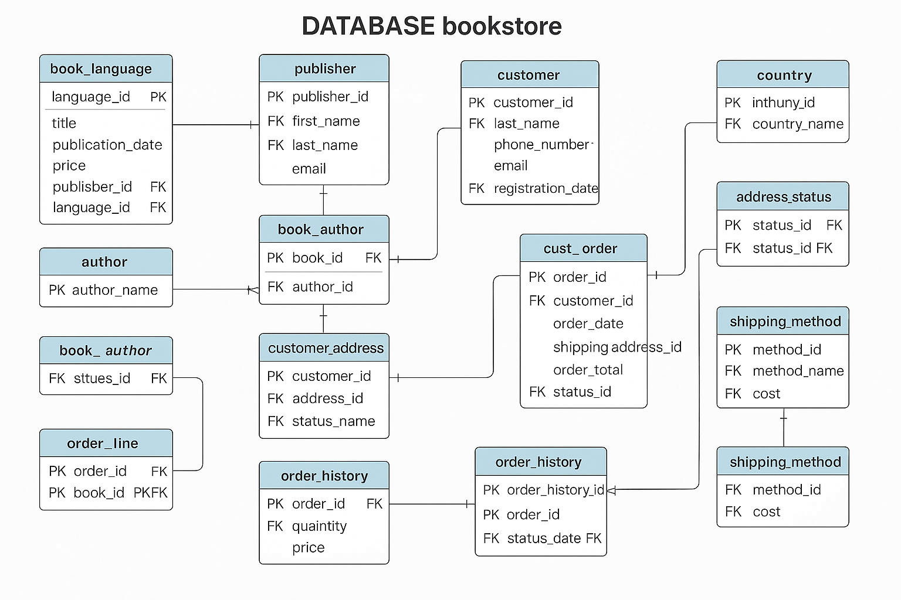

---

# Bookstore Database README

## Overview
This project is designed to manage the operations of a bookstore, including books, authors, customers, orders, publishers, and other related entities. The database is built on MySQL and uses a normalized relational structure with foreign keys to enforce integrity.

### Database Structure
The database includes the following tables:

1. **book_language**: Stores supported languages for books.
2. **publisher**: Stores details about the publishers.
3. **book**: Stores details about books including title, publication date, price, and associated language and publisher.
4. **author**: Stores author names.
5. **book_author**: A junction table to represent the many-to-many relationship between books and authors.
6. **customer**: Stores customer details.
7. **address**: Stores customer addresses.
8. **country**: Stores country details for addresses.
9. **address_status**: Represents the status of an address (e.g., Home, Work, etc.).
10. **customer_address**: Represents the relationship between customers and their addresses.
11. **order_status**: Defines the various order statuses (Pending, Shipped, Delivered, etc.).
12. **cust_order**: Stores customer orders, including their shipping address and status.
13. **shipping_method**: Stores different shipping methods and their associated costs.
14. **order_history**: Tracks the status changes for each order.
15. **order_line**: Represents each book in an order, including quantity and price.

## ER Diagram



The above diagram provides a visual representation of the database schema, showing the relationships between the various tables.

## Queries for Data Retrieval

Below are some sample SQL queries to retrieve useful data from the database.

### 1. Get All Books and Their Authors
```sql
SELECT b.title, a.author_name
FROM book b
JOIN book_author ba ON b.book_id = ba.book_id
JOIN author a ON ba.author_id = a.author_id;
```

### 2. Get All Orders Placed by a Specific Customer
```sql
SELECT o.order_id, o.order_date, o.order_total, os.status_name
FROM cust_order o
JOIN order_status os ON o.status_id = os.status_id
WHERE o.customer_id = 1; -- Replace 1 with the customer_id you want to query
```

### 3. Get All Orders of a Specific Book
```sql
SELECT o.order_id, o.order_date, ol.quantity, b.title
FROM order_line ol
JOIN cust_order o ON ol.order_id = o.order_id
JOIN book b ON ol.book_id = b.book_id
WHERE b.book_id = 1; -- Replace 1 with the book_id you want to query
```

### 4. Get All Books in a Specific Language
```sql
SELECT b.title
FROM book b
JOIN book_language bl ON b.language_id = bl.language_id
WHERE bl.language_name = 'English'; -- Replace 'English' with the language you want to query
```

### 5. Get Total Sales for a Specific Publisher
```sql
SELECT p.first_name, p.last_name, SUM(ol.quantity * ol.price) AS total_sales
FROM publisher p
JOIN book b ON p.publisher_id = b.publisher_id
JOIN order_line ol ON b.book_id = ol.book_id
GROUP BY p.publisher_id;
```

### 6. Get Customer Details with Their Addresses
```sql
SELECT c.first_name, c.last_name, a.street, a.city, co.country_name, as.status_name
FROM customer c
JOIN customer_address ca ON c.customer_id = ca.customer_id
JOIN address a ON ca.address_id = a.address_id
JOIN country co ON a.country_id = co.country_id
JOIN address_status as ON ca.status_id = as.status_id
WHERE c.customer_id = 1; -- Replace 1 with the customer_id you want to query
```

### 7. Get All Shipping Methods and Their Costs
```sql
SELECT method_name, cost
FROM shipping_method;
```

### 8. Get Order History for a Specific Order
```sql
SELECT oh.status_date, os.status_name
FROM order_history oh
JOIN order_status os ON oh.status_id = os.status_id
WHERE oh.order_id = 1; -- Replace 1 with the order_id you want to query
```

---

## How to Use

1. **Set up the database**:
   - Download the SQL script and run it in your MySQL environment to set up the bookstore database.
   - Ensure that you have the correct privileges to create databases, tables, and insert data.

2. **ER Diagram**:
   - To visualize the schema, an ER diagram has been included. You can use the diagram to better understand the relationships between tables.
   
3. **SQL Queries**:
   - Use the sample SQL queries above to extract data based on your requirements.
   - You can modify the `WHERE` clauses in the queries to target specific records as needed.

4. **User Roles**:
   - The following user roles have been created with specific privileges:
     - **admin**: Full privileges on the database.
     - **sales**: Limited access to sales-related tables (e.g., customer, orders).
     - **inventory**: Full access to book and author management.
     - **user_view**: Read-only access to the database.

## Conclusion
This database allows for comprehensive management of a bookstore, including handling books, orders, customers, and shipping. The provided SQL queries can help retrieve important data and generate insights for the bookstore’s operations.

For any changes or queries specific to your business needs, modify the existing queries or add new ones as needed.

---

